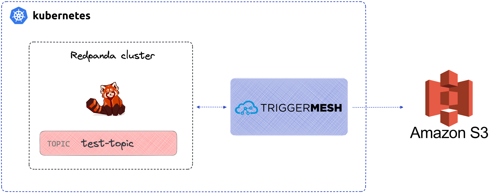

# Kubernetes-native connectivity for Redpanda with TriggerMesh, example with AWS S3

This is the code used in a tutorial where we use TriggerMesh to stream data from a Redpanda topic into an AWS S3 bucket—the Kubernetes-native way. To read the whole explanation, check the blog post "Kubernetes-native connectivity for Redpanda with TriggerMesh".

The post dives into a specific example of using TriggerMesh to stream data from a Redpanda topic into an AWS S3 bucket, with everything running the Kubernetes-native way. 

You'll find the following files in this repo that were used in the post:
* The [kind-config.yaml](kind-config.yaml) file used to create a local Kind cluster
* the Knative Serving ingress config manifest [knative-serving-ingress.yaml](knative-serving-ingress.yaml)
* the S3 target connector manifest [awsS3target.yaml](awsS3target.yaml)
* the Kafka source connector manifest that reads from Redpanda, [kafkasource.yaml](kafkasource.yaml)

If you'd like to give TriggerMesh a try, you can head over to [the quickstart guide](https://docs.triggermesh.io/1.24/get-started/quickstart/) or [join the community on Slack](https://join.slack.com/t/triggermesh-community/shared_invite/zt-1kngevosm-MY7kqn9h6bT08hWh8PeltA) and ask all your questions.

To learn more about Redpanda, check out our [documentation](https://docs.redpanda.com/docs/home) and browse the [Redpanda blog](https://redpanda.com/blog) for tutorials and guides on how to easily integrate with Redpanda. For a more hands-on approach, take [Redpanda's free Community edition](https://redpanda.com/try-redpanda) for a test drive! 

If you get stuck, have a question, or just want to chat with the team and fellow Redpanda users, join the [Redpanda Community](https://redpanda.com/slack) on Slack.
